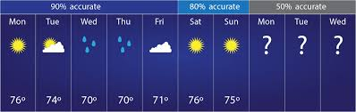

# Weather Prediction Using Neural Networks

## Background

Weather prediction is a crucial application in meteorology, helping us prepare for various weather conditions. This project aims to create a simple neural network model using Keras to predict weather conditions based on input features such as temperature and humidity.

## Objective

The primary objective of this project is to develop a neural network model that can accurately predict whether the weather will be sunny or rainy based on given temperature and humidity data. The model is trained using a small, manually created dataset for demonstration purposes.

## Achievements

- **Data Preparation:** Created a dummy dataset with temperature, humidity, and weather conditions (sunny/rainy).
- **Model Development:** Designed and implemented a neural network model using the Keras library.
- **Model Training:** Trained the neural network model on the dummy dataset to achieve a good level of accuracy.
- **Weather Prediction:** Utilized the trained model to predict weather conditions based on new input data.

## Dataset

The dataset used for this project is a small, manually created dataset for demonstration purposes. The dataset consists of temperature, humidity, and weather conditions. The input features are temperature and humidity, and the output label is the weather condition (1 for sunny, 0 for rainy).

Sample data:
Temperature (°C) | Humidity (%) | Weather
25 | 70 | 1 (sunny)
20 | 85 | 0 (rainy)
30 | 60 | 1 (sunny)
18 | 90 | 0 (rainy)
22 | 75 | 1 (sunny)


## Model Implementation

The neural network model is implemented using the Keras library. Below is the code for the model:

```python
import numpy as np
from keras.models import Sequential
from keras.layers import Dense

# Generate some dummy data for demonstration
data = np.array([[25, 70, 1],
                 [20, 85, 0],
                 [30, 60, 1],
                 [18, 90, 0],
                 [22, 75, 1]])

# Split the data into input features (X) and output labels (y)
X = data[:, :2]
y = data[:, 2]

# Create a sequential model
model = Sequential()

# Add layers to the model
model.add(Dense(units=8, activation='relu', input_dim=2))
model.add(Dense(units=1, activation='sigmoid'))

# Compile the model
model.compile(optimizer='adam', loss='binary_crossentropy', metrics=['accuracy'])

# Train the model
model.fit(X, y, epochs=100, batch_size=2)

# Now, you can use the trained model for weather prediction
temperature = 28
humidity = 65
input_data = np.array([[temperature, humidity]])

# Make a prediction
prediction = model.predict(input_data)

# Convert the prediction to a weather label
weather = "sunny" if prediction[0][0] > 0.5 else "rainy"

print(f"The predicted weather for temperature {temperature}°C and humidity {humidity}% is: {weather}")
```